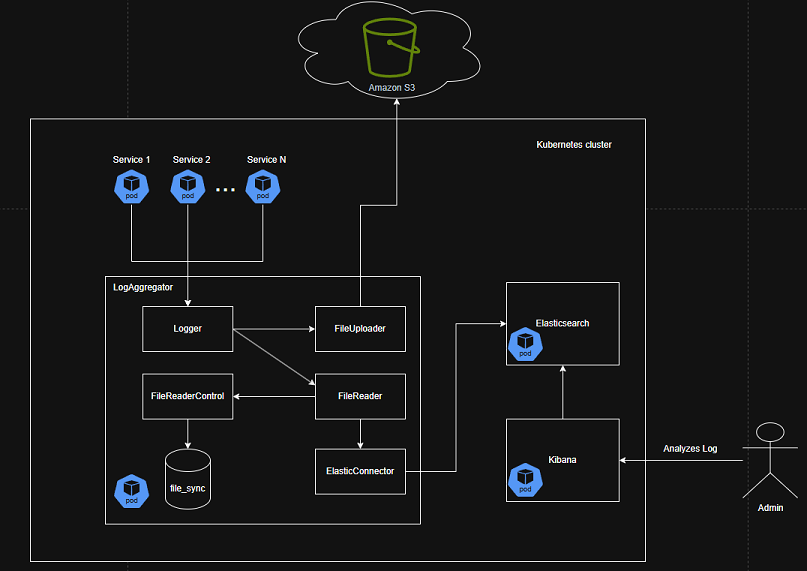

# Log Aggregator

A micro-services based approach to collect logs from different soruces, process them and store them in a cloud-based solution to allow analysis. This app collects logs from different sources, parses them and then sends it to a Elasticsearch-Kibana stack for indexing and analysis

LogAggregator can be seen as a (very) specific subset of [Logstash](https://www.elastic.co/logstash), a data pipeline that collects, process and sends the log to a specific "stash", which is usually the log collector when using the ELK stash (Elasticsearch-Logstash-Kibana) for log analysis. In this sense, the design of LogAggregator allows any service with a local log solution to forward its logging data to LogAggregator and then enabling analysis in a central service. 

It is built upon a Flask application with JWT authentication for log posting. Services that will be monitored by this solution need to register and get a valid user, which can be done by requesting to the admin of the service. Only the admin has access to create new users.

## Stack used

Python 3.13.2

Flask

GUnicorn (WSGI server)

Elasticserach v8.17 for indexing

Kibana v8.17 for log analysis.

Amazon S3 for log storage

## Architecture

The following diagram describes the current architecture of the solution, broken down in the key components used within the LogAggregator solution:



Mainly, the objective of LogAggregator is to consolidate, parse and send the logs for storage in S3 and for indexing in Elasticsearch. Lastly, Kibana is directly plugged into Elasticsearch which allows us to use all the tooling that Kibana provides for index patterns, analysis, alerts, etc, all based on the data that the LogAggregator pushes.


## Author
[Erick Grilo](https://simasgrilo.github.io)

## Features:
- [X] Log collection from services that needs to log just need to send the service to the logging service (given that the service is authorized) in a standardized manner
- Authentication and Authorization using JWT for logging measures
- [X] User creation and administration by admin
- [X] Serverless (deployed in cloud, both the service and the logs)
- [X] Visualization of the logs using Kibana, including alert setup
- [X] Kubernetes-ready solution

## Getting Started

The following steps will allow you to setup a local Kubernetes cluster. It assumes that you have already a k8s distribution installed like minikube or k3s. It also assumes that you have your AWS credentials set up (preferably a IAM user with access key and access secret key setup)

- Start by installing Elastic's CRDs for Kibana and Elasticsearch

```
kubectl apply -f https://download.elastic.co/downloads/eck/2.2.0/operator.yaml
kubectl apply -f "C:\Next level\PSP - Yuri\100 Days\LogAggregator\kube\elasticsearch.yaml"
kubectl apply -f "C:\Next level\PSP - Yuri\100 Days\LogAggregator\kube\kibana.yaml"
```

- Retrieve the Elastic secret for the elastic user to be used in the Elasticsearch connection
```
kubectl get secret es-es-elastic-user -o go-template='{{.data.elastic | base64decode}}'
```

- Setup the LogAggregator with the following commands. Remember to update file kube/log-aggregator-volume.yaml with your elastic credentials. Note that htis step will require simasgrilo/log-aggregator:latest pushed to Docker Hub (which currently is, but you can also build your own container from this project's Dockerfile.)
```
kubectl create secret generic aws-credentials --from-literal=aws_access_key_id=YOUR_AWS_ACCESS_KEY_ID --from-literal=aws_secret_access_key=YOUR_AWS_SECRET_ACCESS_KEY
kubectl apply -f "kube/log-aggregator-volume.yaml"
kubectl apply -f "kube/log-aggregator.yaml"
```

And it's good to go! to add a service to the cluster to be monitored by LogAggregator, you can refer to a sample service in [DNSResolvr](https://github.com/simasgrilo/DNSResolvr)

```
kubectl apply -f "dns-resolver-configmap.yaml"
kubectl apply -f "dns-resolver.yaml"
```

Note that to communicate with the LogAggregator, one can use a similar configmap as ```dns-resolver-configmap.yaml``` and refer to the corresponding service name and port exposed by the Kubernetes service in file ```kube/log-aggregator-volume.yaml```, namely in this section:

```  
    {
      "LogAggregator": {
          "protocol": "http",
          "host": "log-aggregator-service",
          "port": 3001,
          "endpoint": "/log",
          "username" : <logAggregatorUser>,
          "password" : <logAggregatorUserPassword>,
          "login": "/auth/login"
      },
```

Upon startup, a user "admin" is generated with a random password. be sure to store this as this will be used to create system users for the other services being logged.

# Demo

Under construction
